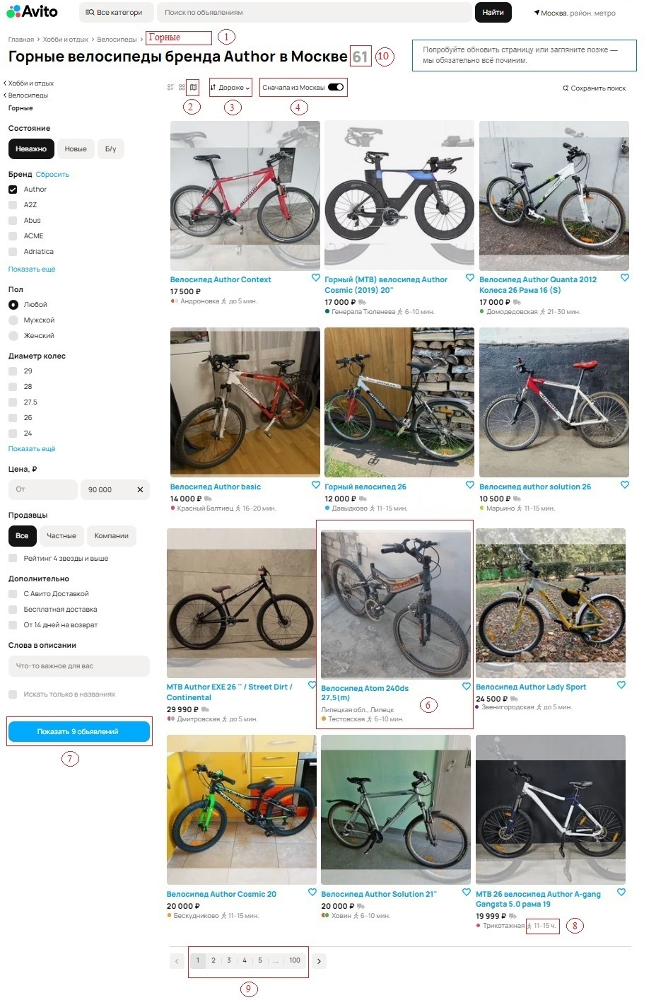

### Задание 1

После просмотра скриншота были определены потенциальные места для багов. На приложенном Рисунке ниже они обведены в красную прямоугольную рамку и помечены номерами

Был изучен сайт [www.avito.ru](https://www.avito.ru)

Некоторые фильтры при изменениях параметров не подтягивают обновления веб-страницы, поэтому потенциальные баги 4, 7, 10 можно не считать багами при определенной последовательности действий Пользователем:

1. Пользователь заходит на сайт [www.avito.ru](https://www.avito.ru)
2. Пользователь вручную переходит в категорию "Хобби и отдых" -> "Велосипеды" -> "Горные" через каталог категорий
3. Настраивает  фильтр "Бренд" в левой панели в значении "Author", нажимает "Показать ... объявлений"
4. Еще раз настраивает остальные фильтры в левой панели ("Цена", "Пол", "Продавцы"), НО НЕ НАЖИМАЕТ "Показать 9 объявлений", тем самым не применяя выбранные фильтры
5. Нажимает на свитч "Сначала из Москвы"

Этими действиями можно объяснить различие значений в боксах 10 и 7, а также неверную сортировку товаров "Сначала из Москвы" (товары из Липецкой обл. и Санкт-Петербурга оказались раньше, чем московские)

На основании этого можно выделить следующие баги:

1. Бокс 1: в пути по категориямне хватает  выбранного вида велосипеда "Горные" **Ожидаемое поведение**: Путь должен выглядеть: Главная > Хобби и отдых > Велосипеды > Горные  **Фактический результат**: путь выглядит: Главная > Хобби и отдых > Велосипеды.  **Приоритет** - low, т.к. несильно влияет на функционал, визуальная ошибка
2. Бокс 2: Выбран тип просмотра объявлений на карте, а на скриншоте - карточки товаров.  **Ожидаемое поведение**: на скриншоте изображена карта Москвы с найденными товарами.  **Фактический результат**: на скриншшоте изображены карточки товаров.  **Приоритет** - high, т.к. пользователь хотел увидеть объявления на карте и будет раздражен
3. Бокс 3: Отсутствует сортировка по цене "Дороже".  **Ожидаемое поведение**: товары отсортированы по цене, по убыванию.  **Фактический результат**: сортировка по цене отсутствует.  **Приоритет** - high, т.к. пользователь заинтересован в более дорогостоящих моделях и будет раздражен
4. Бокс 6: При поиске велосипедов Author в результат поиска попал сторонный бренд Atom. У него отсутствует цена.  **Ожидаемое поведение**: в карточках товаров только велосипеды Author; если у товара отсутствует цена - это указано текстом (например, "цена договорная").  **Фактический результат**: в карточках товаров присутствует велосипед бренда Atom. Его цена не указана.  **Приоритет** - medium, т.к. пользователь заинтересован в бренде author (но доля ошибок мала)
5. Бокс 8: У одного из товаров указано неоптимальное значение расстояния от метро.  **Ожидаемое поведение**: указана аватарка общественного транспорта или машины с временем пути до продавца.  **Фактический результат**: указано, что до дома продавца идти 11-15 часов.  **Приоритет** - medium, так как расстояние от метро важный параметр (но доля ошибок мала)
6. Бокс 9: Указано неверное число страниц при пагинации.  **Ожидаемое поведение**: будет всего 6 страниц (всего товаров/количество на ожной странице; [61/12] + 1 = 6).  **Фактический результат**: доступно для просмотра 100 страниц.  **Приоритет** - high, так как сайт может упасть при переходе на страницы, большие 6. (Если пагинация реализована на бекенде, то возможна ошибка на стороне сервера)

